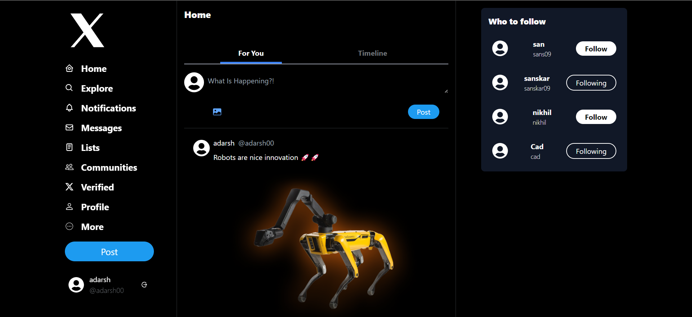

# X-website

X-clone Using MERN-Stack 

## Project Description

- Created the Backend with the use of Node and express and used MongoDB as the database
- Frontend is Made by React and styling is done by tailwind CSS.
- Backend is hosted on Cyclic.sh
- Frontend is hosted on Vercel.app

### Live Demo

Use Laptop/Desktop to view the demo it is not fully responsive

**[Live Demo](https://x-clon.vercel.app/)**

## Screenshots

#### Login Page

#### Home Page

#### Profile Page

